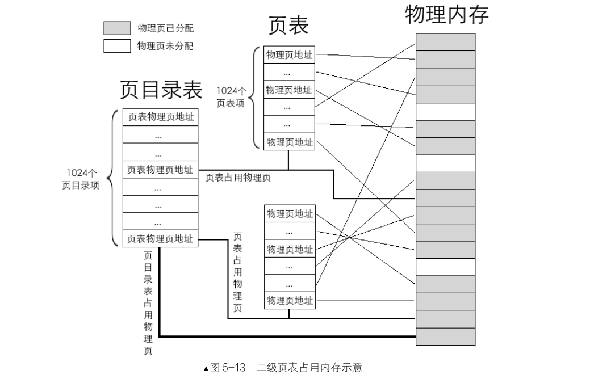
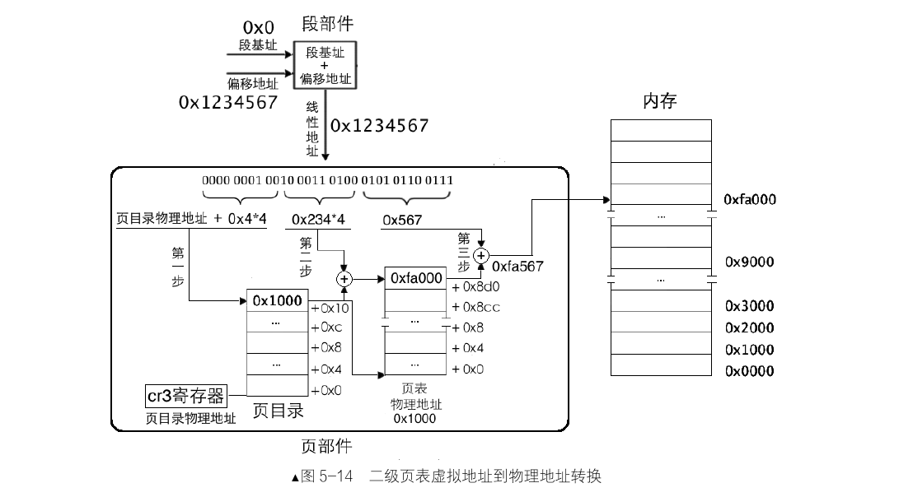

```sh
{
nasm -I boot/include/ -o boot/mbr.bin boot/mbr.S
dd if=boot/mbr.bin of=/home/hanyu/bochs/HD60.img bs=512 count=1 conv=notrunc

nasm -I boot/include/ -o boot/loader.bin boot/loader.S
dd if=boot/loader.bin of=/home/hanyu/bochs/HD60.img bs=512 count=2 seek=2 conv=notrunc

gcc -m32 -c -o kernel/main.o kernel/main.c
ld -m elf_i386 kernel/main.o -Ttext 0xc0001500 -e main -o kernel/kernel.bin
dd if=/home/hanyu/bochs/chapter6/a/kernel/kernel.bin of=/home/hanyu/bochs/HD60.img bs=512 count=200 seek=9 conv=notrunc

bochs -f /home/hanyu/bochs/bochsrc.disk -q
}
```
# 内存分页

## 0.内存段

### 1.什么是内存段?为什么要有内存段

`内存段`（Memory Segment）是一种将内存划分为多个逻辑区块的方式。在保护模式下，内存段是操作系统和 CPU 用来管理内存地址的一种机制。通过这种机制，系统可以对每个段的访问权限、大小、起始地址等进行控制和管理，使得不同进程和数据类型可以在独立的内存区域中运行。

在内存段机制中，整个内存空间被划分为多个段，每个段具有独立的起始地址（基址）和长度（段限长）。这可以让同一个虚拟地址空间中的不同段实现不同的存储和保护。例如，代码段、数据段和栈段就是典型的内存段，每个段分别存储不同类型的内容。

引入内存段是为了解决一些直接访问物理内存的问题，并改善内存管理。内存段机制的主要目的有以下几点：

1：地址空间隔离

直接访问物理内存的程序难以保证各进程的地址空间隔离。如果一个程序可以直接访问物理内存，那么恶意程序可能会随意修改其他进程的数据，导致系统崩溃或数据损坏。内存段允许操作系统给每个程序分配独立的段，从而隔离不同进程的内存区域，保证进程间的安全性。

2：提高内存使用效率

在没有内存段的情况下，如果系统物理内存不足以运行所有程序，需要频繁将一些程序数据从内存移到硬盘（即“换出”），并在需要时再将其移回内存（即“换入”）。内存段机制与分页机制结合使用，可以让操作系统更灵活地管理内存，避免频繁的换入和换出操作，提高内存使用效率。

3：独立的虚拟地址

没有段机制时，程序的内存分配是动态的，地址不固定。当多个程序共享同一块物理内存时，不同程序的起始地址不一致。通过引入段机制，每个程序可在其逻辑地址空间内进行访问。操作系统负责将程序的逻辑地址映射为物理内存地址，使不同程序的地址空间互不干扰，保持独立。

## 1.段描述符

在保护模式下，CPU 使用段描述符来管理内存段，段描述符会记录该段的基址、大小、权限等信息。段描述符提供了一种灵活的机制，使得操作系统可以控制每个段的权限、大小以及是否存在于内存中。

1. 段描述符与 GDT/LDT

每个段描述符记录了该段的基址、大小、访问权限、存在位（P 位）等信息。段描述符通常存储在全局描述符表（GDT）或局部描述符表（LDT）中。GDT 是系统级的，适用于整个操作系统，而 LDT 是进程级的，用于某个特定进程。

2. P 位与 NP 异常

段描述符的 P 位（Present bit）用于标识段是否在内存中。当 P 位为 1 时，表示该段已加载到内存，CPU 可以直接访问；当 P 位为 0 时，表示该段当前不在内存中。此时，若 CPU 尝试访问该段，会触发 NP（Not Present）异常。

操作系统会在异常处理中断服务程序中负责处理 NP 异常。一般来说，该服务程序会执行以下步骤：

- 从外存（例如硬盘）中加载该段数据到内存中。
- 更新段描述符，将 P 位置为 1。
- 恢复异常发生时的状态，使 CPU 可以重新访问该段。

3. A 位与段访问记录

A 位（Accessed bit）用于记录该段是否被访问。每次访问段时，CPU 会自动将 A 位置为 1。这样操作系统可以通过读取 A 位状态来追踪段的使用情况，并在适当时候清除 A 位，以便在下一个周期重新开始记录访问情况。

操作系统会定期清零 A 位，并记录每次设置 A 位为 1 的次数。通过这种方法，可以估算每个段的访问频率，并在内存不足时优先将访问频率低的段换出到硬盘。

4. 内存换出和换入

当物理内存不足时，操作系统可能会将较少使用的段换出到硬盘。换出的段描述符的 P 位会被置 0，以表明段不在内存中。当该段再次被访问时，CPU 会检测到 P 位为 0，触发 NP 异常。操作系统的异常处理程序会负责将段重新加载到内存中，并将段描述符的 P 位置 1，以便段可以再次正常访问。

5. 内存与外存的二进制存储

内存与外存中数据的存储都是二进制的。在段管理中，换出和换入的过程相当于二进制数据的拷贝。当段被换出到硬盘时，实际上是将该段数据以相同的二进制形式写入外存；当段被换入时，则是将数据从外存读取到内存。这类似于将一个文本文件读取到内存中进行编辑，完成后再保存到硬盘的过程。

## 2.一级页表
页是地址空间的计量单位，只要是 4KB 的地址空间都可以称为一页

在操作系统的分页机制中，内存被划分成等大小的页（通常为 4KB），每一页代表一个地址空间单位。虚拟地址空间中的每一页必须对应到物理地址空间的一页。对于 4GB 的虚拟地址空间而言，内存划分为 4GB/4KB=1M个页，这就需要页表来维护这些页的映射关系，其中一级页表包含 1048576 个页表项来管理这些页。

1.准备

在启用分页机制前，CPU 需要知道页表的存储位置。具体准备工作如下：

- 加载页表地址到 CR3：在启用分页机制前，页表的物理地址需要加载到控制寄存器 CR3 中，以便 CPU 在地址转换时访问正确的页表。此时，CR3 寄存器指向页表的物理地址，因此页表项的地址也是物理地址。

- 避免递归转换：尽管分页机制负责将虚拟地址转换成物理地址，但在页表中检索和寻址时，这些地址是直接当作物理地址的，不会再递归地经过分页转换。也就是说，CPU 在访问页表时直接使用的是物理地址，不受分页机制的影响。

2.页部件

CPU 中集成了专门用来干这项工作的硬件模块，我们把该模块称为页部件。当程序中给出一个线性地址时，页部件分析线性地址，按照算法，自动在页表中检索到物理地址。

页部件的工作：

用线性地址的高 20 位在页表中索引页表项，用线性地址的低 12 位与页表项中的物理地址相加，所求的和便是最终线性地址对应的物理地址。

## 3.二级页表
1.准备

- 一级页表中最多可容纳 1M个页表项，每个页表项是 4 字节，如果页表项全满的话，便是 4MB 大小。
- 一级页表中所有页表项必须要提前建好，原因是操作系统要占用 4GB 虚拟地址空间的高 1GB，用户进程要占用低 3GB。
- 每个进程都有自己的页表，进程一多，光是页表占用的空间就很可观了。

二级页表通过两个层级的表来管理虚拟地址空间，从而减少了单级页表的存储负担。通过这种方式，每个进程可以有效地使用自己的页表，而不需要为整个地址空间提前分配所有页表项。

无论是几级页表，标准页的尺寸都是 4KB，这一点是不变的。所以 4GB 线性地址空间最多有 1M 个标准页。

一级页表是将这 1M 个标准页放置到一张页表中，二级页表是将这 1M 个标准页平均放置 1K 个页表中。

每个页表中包含有 1K 个页表项。页表项是 4 字节大小，页表包含 1K 个页表项，故页表大小为4KB，这恰恰是一个标准页的大小。

2.页目录表

专门有个`页目录表`来存储这些页表。每个页表的物理地址在页目录表中都以页目录项（Page Directory Entry， PDE）的形式存储，页目录项大小同页表项一样，都用来描述一个物理页的物理地址，其大小都是 4 字节，而且最多有 1024 个页表，所以页目录表也是 4KB 大小。



图 5-13 中，页目录表中共 1024 个页表，也就是有 1024 个页目录项。

一个页目录项中记录一个页表物理页地址，物理页地址是指页的物理地址，在页目录项及页表项中记录的都是页的物理地址。

每个页表中有 1024 个页表项，每个页表项中是一个物理页地址，最终数据写在这页表项中指定的物理页中。

操作系统负责这些物理页的分配与释放。

由于页目录表和页表本身都要占用内存，且为 4KB 大小，故它们也会由操作系统在物理内存中分配一物理页存放。

图中最粗的线存放页目录表物理页，稍细一点的线指向的是用来存放页表的物理页，其他最细的线是页表项中分配的物理页，页表结构本身与其他数据混布渗透在物理内存中，页表所占用的物理页在外在形式上与其他数据占用的物理页没有什么不同，只有 CPU 知道它们的作用不同。

3.转换

- 一级页表转换方法:将 32 位虚拟地址拆分成两部分，高 20 位用于定位一个物理页，低 12 位用于物理页内的偏移量。

- 二级页表转换，依然用 32 位虚拟地址的不同部分来定位物理页:

每个页表中可容纳 1024 个物理页，故每个页表可表示的内存容量是 1024*4KB=4MB。

页目录中共有1024 个页表，故所有页表可表示的内存容量是 1024*4MB=4GB，这已经达到了 32 位地址空间的最大容量。

所以说，任意一个 32 位物理地址，它必然在某个页表之内的某个物理页中。

我们定位某一个物理页，必然要先找到其所属的页表。页目录中 1024 个页表，只需要 10 位二进制就能够表示了，所以，虚拟地址的高10 位（第 31～22 位）用来在页目录中定位一个页表，也就是这高 10 位用于定位页目录中的页目录项 PDE，PDE 中有页表物理页地址。

找到页表后，到底是页表中哪一个物理页呢？

由于表中可容纳 1024 个物理页，故只需要 10 位二进制就能够表示了。

所以虚拟地址的中间 10 位（第 21～12 位）用来在页表中定位具体的物理页，也就是在页表中定位一个页表项 PTE，PTE 中有分配的物理页地址。

由于标准页都是 4KB，12 位二进制便可以表达 4KB 之内的任意地址，故线性地址中余下的 12 位（第 11～0 位）用于页内偏移量。

经以上分析，二级页表地址转换原理是将 32 位虚拟地址拆分成高 10 位、中间 10 位、低 12 位三部分

它们的作用是：高 10 位作为页表的索引，用于在页目录表中定位一个页目录项 PDE，页目录项中有页表物理地址，也就是定位到了某个页表。

中间 10 位作为物理页的索引，用于在页表内定位到某个页表项 PTE，页表项中有分配的物理页地址，也就是定位到了某个物理页。

低 12 位作为页内偏移量用于在已经定位到的物理页内寻址。

4.地址转换

同一级页表一样，访问任何页表内的数据都要通过物理地址。

由于页目录项 PDE 和页表项 PTE 都是4 字节大小，给出了 PDE 和 PTE 索引后，还需要在背后悄悄乘以 4，再加上页表物理地址，这才是最终要访问的绝对物理地址。转换过程背后的具体步骤如下。

- 用虚拟地址的高 10 位乘以 4，作为页目录表内的偏移地址，加上页目录表的物理地址，所得的和，便是页目录项的物理地址。读取该页目录项，从中获取到页表的物理地址。
- 用虚拟地址的中间 10 位乘以 4，作为页表内的偏移地址，加上在第 1 步中得到的页表物理地址，所得的和，便是页表项的物理地址。读取该页表项，从中获取到分配的物理页地址。
- 虚拟地址的高 10 位和中间 10 位分别是 PDE 和 PTE 的索引值，所以它们需要乘以 4。但低 12 位就不是索引值啦，其表示的范围是 0～0xfff，作为页内偏移最合适，所以虚拟地址的低 12 位加上第 2 步中得到的物理页地址，所得的和便是最终转换的物理地址。这种自动化较强的工作，还是由页部件自动完成的。


以虚拟地址0x1234567为例：

- 定位页目录项 (PDE)

取高10位值0x4，乘以4得到偏移量0x10。

将该偏移量与CR3寄存器中页目录表的基地址相加，得到PDE的物理地址。

读取PDE，获得页表的物理地址0x1000。
- 定位页表项 (PTE)
取中间10位值0x234，乘以4得到偏移量0x8d0。

将该偏移量与页表基地址0x1000相加，得到PTE的物理地址0x18d0。

读取PTE，获得物理页的基地址0xfa000。
- 计算页内偏移
取低12位值0x567作为页内偏移。

将偏移量与物理页基地址相加，得到最终物理地址0xfa567。

平坦模型下段基址为 0，指令 mov ax，[0x1234567]，
## 4.启用分页机制

启用分页机制，我们要按顺序做好三件事:

### 准备好页目录表及页表
- 页目录表包含 1024 个 4 字节的条目，每个条目指向一个页表。
- 每个页表也包含 1024 个条目，每个条目指向一个 4KB 大小的物理页。
- 页目录表和页表需要对齐到 4KB 的边界，以符合分页机制的要求。

### 将页表地址写入控制寄存器 cr3

页表有个专门的寄存器来存储其地址，即`控制寄存器 cr3 `，又称为页目录基址寄存器（Page Directory BaseRegister，PDBR）。

由于页目录表所在的地址要求在一个自然页内，即页页目录基址寄存器 PDBR（控制寄存器 cr3）目录的起始地址是 4KB 的整数倍，低 12 位地址全是 0。

所以，只要在 cr3 寄存器的第 31～12 位中写入物理地址的高 20 位就行了。

cr3 寄存器的低 12 位中，除第 3 位的 PWT 位和第 4 位的 PCD 位外，其余位都没用。这样一来低 12 位全部为 0，故只需要把页目录表物理地址的高 20 位写入 cr3 寄存器即可。

因为控制寄存器是可以与通用寄存器互相传递数据的，所以为 cr3 寄存器赋值则没有那么复杂，可以用现成的 mov 命令，mov 指令中控制寄存器与通用寄存器互传数据的格式是：

mov cr[0～7]，r32 或 mov r32，cr[0～7]
### 启动分页机制的开关

启动分页机制的开关是将控制寄存器 cr0 的 PG 位置 1

PG 位是 cr0 寄存器的最后一位：第 31 位

PG 位为 1 后便进入了内存分页运行机制，段部件输出的线性地址成为虚拟地址（顺便说一下，第 0 位是 PE位，用来进入保护模式的开关）。

执行以上步骤后，CPU 将进入分页模式。在进入分页模式之前，系统在分段模式下工作，段寄存器输出的线性地址直接作为物理地址。而一旦进入分页模式，线性地址将转换为物理地址，这也是 CR3 寄存器必须包含页表物理地址的原因。