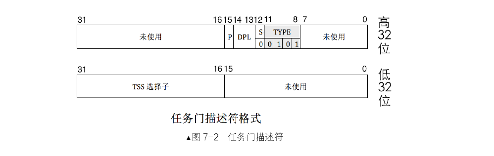
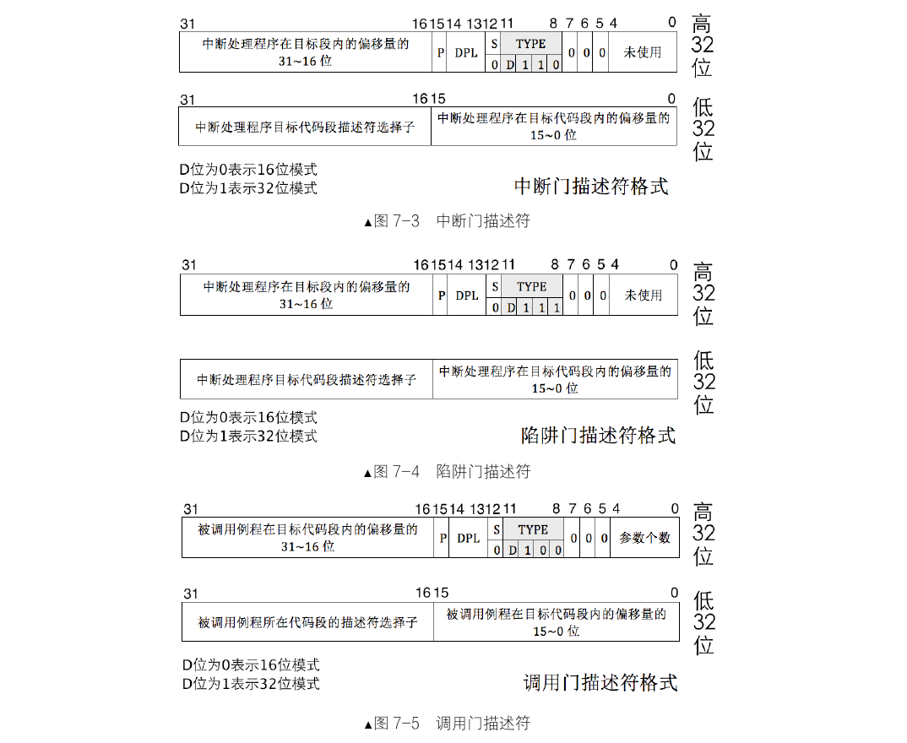
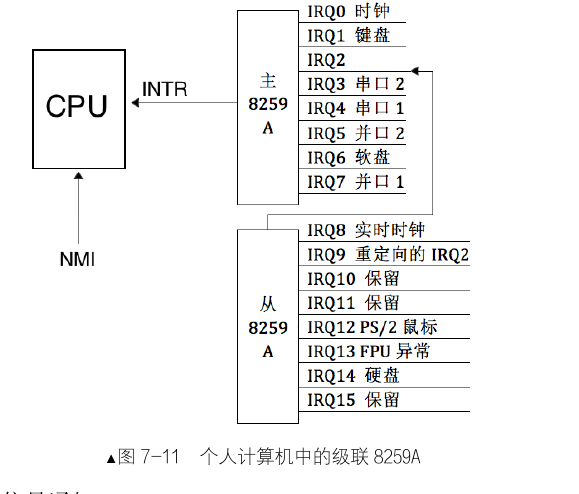
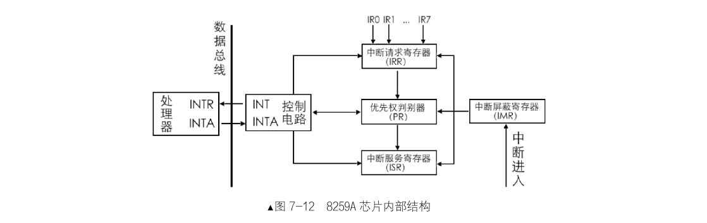

# 中断
CPU 获知了计算机中发生的某些事，CPU 暂停正在执行的程序，转而去执行处理该事件的程序，
当这段程序执行完毕后，CPU 继续执行刚才的程序。整个过程称为中断处理，也称为中断。
因为有了中断，系统才能并发运行，单核 CPU 谈并发，多核 CPU 谈并行。

### 外部中断
外部中断是指来自 CPU 外部的中断，而外部的中断源必须是某个硬件，所以外部中断又称为硬件中断。

从 INTR 引脚收到的中断都是不影响系统运行的，从 NMI 引脚收到的中断，那基本上全是硬件上的。

1.`可屏蔽中断`
可屏蔽中断是通过 INTR 引脚进入 CPU 的，外部设备如硬盘、网卡等发出的中断都是可屏蔽中断

把中断处理程序分为上半部和下半部两部分，其中需要立即执行的部分划分到上半部，这部分是要限时执行的，
所以通常情况下只完成中断应答或硬件复位等重要紧迫的工作。
而中断处理程序中那些不紧急的部分则被推迟到下半部中去完成。由于中断处理程序的上半部是刻不容缓要执行的，
所以上半部是在关中断不被打扰的情况下执行的。
当上半部执行完成后就把中断打开了，下半部也属于中断处理程序，所以中断处理程序下半部则是在开中断的情况下执行的，
如果有新的中断发生，原来这个旧中断的下半部就会被换下 CPU，先执行新的中断处理程序的上半部，
等待线程调度机制为旧中断处理程序择一日期后，再调度其上 CPU 完成其下半部的执行。

2.`不可屏蔽中断`
不可屏蔽中断是通过 NMI 引脚进入 CPU 的，它表示系统中发生了致命的错误

CPU 收到中断后，通过中断向量表或中断描述符表来实现的，首先为每一种中断分配一个中断向量号，
中断向量号就是一个整数，它就是中断向量表或中断描述符表中的索引下标，用来索引中断项。
中断发起时，相应的中断向量号通过 NMI 或 INTR引脚被传入 CPU，中断向量号是中断向量表或中断描述符表里中断项的下标，CPU 根据此中断向量号在中断向量表或中断描述符表中检索对应的中断处理程序并去执行。不可屏蔽中断的中断向量号为 2。

### 内部中断
1.`软中断`
软中断，就是由软件主动发起的中断

以下是可以发起中断的指令:
- int 8 位立即数。通过它进行系统调用，8 位立即数可表示 256种中断，这与处理器所支持的中断数是相吻合的
- int3。之间无间隙。int3 是调试断点指令，其所触发的中断向量号是 3
- into。这是中断溢出指令，它所触发的中断向量号是 4。
- bound。这是检查数组索引越界指令，它可以触发 5 号中断，用于检查数组的索引下标是否在上下边界之内。
- ud2。未定义指令，这会触发第 6 号中断。该指令表示指令无效，CPU 无法识别。

值得注意的是以上几种软中断指令，除第一种的“int 8 位立即数”之外，其他的几种又可以称为异常。
因为它们既具备软中断的“主动”行为，又具备异常的“错误”结果。

2.`异常`
异常是另一种内部中断，是指令执行期间 CPU 内部产生的错误引起的。

由于是运行时错误，所以它不受标志寄存器 eflags 中的 IF 位影响，无法向用户隐瞒

- Fault，也称为故障。这种错误是可以被修复的一种类型，属于最轻的一种异常，它给软件一次“改
过自新”的机会。当发生此类异常时 CPU 将机器状态恢复到异常之前的状态，之后调用中断处理程序时，
CPU 将返回地址依然指向导致 fault 异常的那条指令。
- Trap，也称为陷阱，这一名称很形象地说明软件掉进了 CPU 设下的陷阱，导致停了下来。此异
常通常用在调试中，比如 int3 指令便引发此类异常，为了让中断处理程序返回后能够继续向下执行，CPU
将中断处理程序的返回地址指向导致异常指令的下一个指令地址。
- Abort，也称为终止。这是最严重的异常类型，一旦出现，由于错误无法修复，程序将无法继续运行，
操作系统为了自保，只能将此程序从进程表中去掉。导致此异常的错误通常是硬件错误，或者某些系统数据结构出错。

# 中断描述符
`中断描述符表`（Interrupt Descriptor Table，IDT）是保护模式下用于存储中断处理程序入口的表，
当CPU 接收一个中断时，需要用中断向量在此表中检索对应的描述符，在该描述符中找到中断处理程序的
起始地址，然后执行中断处理程序。

IDT 中只有这种称为门的描述符,所有的描述符大小都是 8 字节。
除调用门外，另外的任务门、中断门、陷阱门都可以存在于中断描述符表中。

- 任务门
任务门和任务状态段（Task Status Segment，TSS）是 Intel 处理器在硬件一级提供的任务切换机制，所以任
务门需要和 TSS 配合在一起使用，在任务门中记录的是 TSS 选择子，偏移量未使用。任务门可以存在于全局描
述符表 GDT、局部描述符表 LDT、中断描述符表 IDT 中。描述符中任务门的 type 值为二进制 0101，其结构如
图 7-2 所示。顺便说一句大多数操作系统（包括 Linux）都未用 TSS 实现任务切换。
- 中断门
中断门包含了中断处理程序所在段的段选择子和段内偏移地址。当通过此方式进入中断后，标志寄存
器 eflags 中的 IF 位自动置 0，也就是在进入中断后，自动把中断关闭，避免中断嵌套。Linux 就是利用中
断门实现的系统调用，就是那个著名的 int 0x80。中断门只允许存在于 IDT 中。描述符中中断门的 type 值
为二进制 1110，其结构如图 7-3 所示。
- 陷阱门
陷阱门和中断门非常相似，区别是由陷阱门进入中断后，标志寄存器 eflags 中的 IF 位不会自动置 0。
陷阱门只允许存在于 IDT 中。描述符中陷阱门的 type 值为二进制 1111。其结构如图 7-4 所示。
- 调用门
调用门是提供给用户进程进入特权 0 级的方式，其 DPL 为 3。调用门中记录例程的地址，它不能用
int 指令调用，只能用 call 和 jmp 指令。调用门可以安装在 GDT 和 LDT 中。描述符中调用门的 type 值为
二进制 1100。其结构如图 7-5 所示。

### 中断门 
一个中断源就会产生一个中断向量，每个中断向量都对应中断描述符表中的一个门描述符，
任何中断源都通过中断向量对应到中断描述符表中的门描述符，通过该门描述符就找到了对应的中断处理程序。
可见，中断发生后，采取什么样的动作是由中断处理程序决定的，但该程序是在中断描述符表中找到的，该表决定
了中断信号落到哪个程序上

对比中断向量表（实模式），中断描述符表（保护模式）有两个区别：

- 1.中断描述符表地址不限制，在哪里都可以。

- 2.中断描述符表中的每个描述符用 8 字节描述。

在 CPU 内部有个中断描述符表寄存器（Interrupt Descriptor Table Register，IDTR）

该寄存器分为两部分：

第 0～15 位是表界限，即 IDT 大小减 1，第 16～47 位是 IDT 的基地址，和GDTR是一样的原理。
只有寄存器 IDTR指向了 IDT，当 CPU 接收到中断向量号时才能找到中断向量处理程序，这样中断系统才能正常运作。

16 位的表界限，表示最大范围是 0xffff，即 64KB。可容纳的描述符个数是 64KB/8=8K=8192 个。
特别注意的是 GDT 中的第 0个段描述符是不可用的，但 IDT 却无此限制，第 0 个门描述符也是可用的，
中断向量号为 0 的中断是除法错。

但处理器只支持 256个中断，即 0～254，中断描述符中其余的描述符不可用。在门描述符中有个 P 位，
所以，在构建 IDT 时，记得把 P 位置 0，这样就表示门描述符中的中断处理程序不在内存中。

同加载 GDTR 一样，加载 IDTR 也有个专门的指令—lidt，其用法是：lidt 48 位内存数据

在这 48 位内存数据中，前 16 位是 IDT 表界限，后 32 位是 IDT 线性基地址

# 可编程中断控制器 8259A
`Intel 8259A 芯片` , 8259A 的作用是负责所有来自外设的中断，包括来自时钟的中断，可以通过它完成进程调度。

8259A 用于管理和控制可屏蔽中断，它表现在屏蔽外设中断，对它们实行优先级判决，向 CPU 提供
中断向量号等功能。而它称为可编程的原因，就是可以通过编程的方式来设置以上的功能。

### 级联
由于单个 8259A 芯片只有 8 个中断请求信号线：IRQ0～IRQ7，这显然是不够用的，所以它提供了一种组合的方式，可以将多个自己像串联电路一样组合在一起，提供更多的中断请求信号线。这种组合方式就称为级联（cascade）

- INT：8259A 选出优先级最高的中断请求后，发信号通知 CPU。
- INTA：INT Acknowledge，中断响应信号。位于 8259A 中的 INTA 接收来自 CPU 的 INTA 接口的中断响应信号。
- IMR：Interrupt Mask Register，中断屏蔽寄存器，宽度是 8 位，用来屏蔽某个外设的中断。
- IRR：Interrupt Request Register，中断请求寄存器，宽度是 8 位。它的作用是接受经过 IMR 寄存器过滤后的中断信号并锁存，此寄存器中全是等待处理的中断，“相当于”5259A 维护的未处理中断信号队列。
- PR：Priority Resolver，优先级仲裁器。当有多个中断同时发生，或当有新的中断请求进来时，将它与当前正在处理的中断进行比较，找出优先级更高的中断。
- ISR： In-Service Register，中断服务寄存器，宽度是 8 位。当某个中断正在被处理时，保存在此寄存器中。

以上寄存器都是 8 位，其原因是 8259A 共 8 个 IRQ 接口，可以用 8 位寄存器中的每一位代表 8259A 的每个 IRQ 接口

### 工作流程
当某个外设发出一个中断信号时，由于主板上已经将信号通路指向了 8259A 芯片的某个 IRQ 接口，所以该中断信号最终被送入了 8259A。

8259A 首先检查 IMR 寄存器中是否已经屏蔽了来自该 IRQ 接口的中断信号。

IMR 寄存器中的位，为 1，则表示中断屏蔽，为 0，则表示中断放行。

如果该 IRQ 对应的相应位已经被置 1，即表示来自该 IRQ 接口上的中断已经被屏蔽了，则将该中断信号丢弃，

否则，将其送入 IRR寄存器，将该 IRQ 接口所在 IRR 寄存器中对应的 BIT 置 1。

IRR 寄存器的作用“相当于”待处理中断队列。

在某个恰当时机，优先级仲裁器 PR 会从 IRR 寄存器中挑选一个优先级最大的中断，此处的优先级决判很简单，

就是 IRQ 接口号越低，优先级越大，所以 IRQ0 优先级最大。

之后，8259A 会在控制电路中，通过 INT 接口向 CPU 发送 INTR 信号。

信号被送入了 CPU 的 INTR 接口后，这样 CPU 便知道有新的中断到来了，于是 CPU 将手里的指令执行完后，

马上通过自己的 INTA 接口向 8259A 的 INTA接口回复一个中断响应信号，表示现在 CPU 我已准备好啦，8259A 你可以继续后面的工作。

8259A 在收到这个信号后，立即将刚才选出来的优先级最大的中断在 ISR 寄存器中对应的 BIT 置 1，此寄存器表示当前正在处理的中断，

同时要将该中断从“待处理中断队列”寄存器 IRR 中去掉，也就是在 IRR 中将该中断对应的 BIT 置 0。之后，CPU 将再次发送 INTA 信号给8259A，

这一次是想获取中断对应的中断向量号，就是我们前面所说的 0～255 的“整数”。

由于大部分情况下 8259A 的起始中断向量号并不是 0，所以用起始中断向量号+IRQ 接口号便是该设备的中断向量号，由此可见，

外部设备虽然会发中断信号，但它并不知道还有中断向量号这回事，不知道自己会被中断代理（如 8259A）分配一个这样的整数。

随后，8259A 将此中断向量号通过系统数据总线发送给 CPU。CPU 从数据总线上拿到该中断向量号后，用它做中断向量表或中断描述符表中的索引，

找到相应的中断处理程序并去执行。

这才刚完成了上半场。

如果 8259A 的“EOI 通知End Of Interrupt）”若被设置为非自动模式（手工模式），中断处理程序结束处必须有向 8259A 发送 EOI 的代码，

8259A 在收到 EOI 后，将当前正处理的中断在 ISR 寄存器中对应的 BIT 置 0。

如果“EOI 通知”被设置为自动模式，在刚才 8259A 接收到第二个 INTA 信号后，也就是 CPU 向 8259A 要中断向量号的那个 INTA，

8259A 会自动将此中断在 ISR 中对应的 BIT 置 0。

并不是进入了 ISR 后的中断就圣上 CPU 了，它还是有可能被后者换下来的。

比如，在 8259A 发送中断向量号给 CPU 之前，这时候又来了新的中断，如果它的来源 IRQ 接口号比 ISR 中的低，

也就是优先级更高，原来 ISR 中准备上 CPU 处理的旧中断，其对应的 BIT 就得清 0，同时将它所在的 IRR中的相应 BIT 恢复为 1，

随后在 ISR 中将此优先级更高的新中断对应的 BIT 置 1，然后将此新中断的中断向量号发给 CPU。