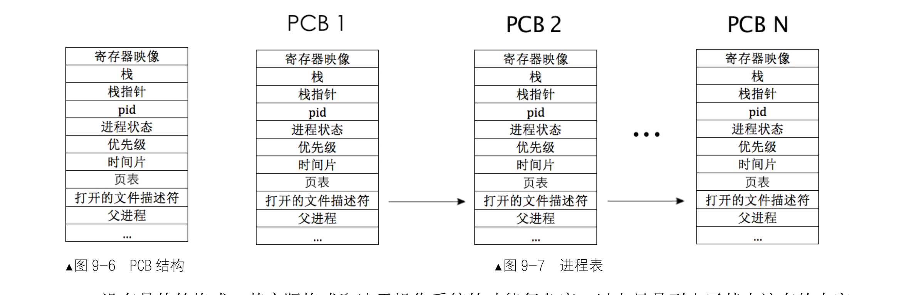

```sh
{
nasm -I boot/include/ -o boot/mbr.bin boot/mbr.S
dd if=boot/mbr.bin of=/home/hanyu/OS/HD60.img bs=512 count=1 conv=notrunc

nasm -I boot/include/ -o boot/loader.bin boot/loader.S
dd if=boot/loader.bin of=/home/hanyu/OS/HD60.img bs=512 count=4 seek=2 conv=notrunc

gcc -m32 -I lib/kernel/ -I lib/ -I kernel/ -c -fno-builtin -fno-stack-protector -o build/main.o kernel/main.c
gcc -m32 -I lib/kernel/ -I lib/ -I kernel/ -c -fno-builtin -fno-stack-protector -o build/interrupt.o kernel/interrupt.c
gcc -m32 -I lib/kernel/ -I lib/ -I kernel/ -c -fno-builtin -fno-stack-protector -o build/init.o kernel/init.c
gcc -m32 -I lib/kernel/ -I lib/ -I kernel/ -c -fno-builtin -fno-stack-protector -o build/timer.o device/timer.c
gcc -m32 -I lib/kernel/ -I lib/ -I kernel/ -c -fno-builtin -fno-stack-protector -o build/debug.o kernel/debug.c
gcc -m32 -I lib/kernel/ -I lib/ -I kernel/ -c -fno-builtin -fno-stack-protector -o build/memory.o kernel/memory.c
gcc -m32 -I lib/kernel/ -I lib/ -I kernel/ -c -fno-builtin -fno-stack-protector -o build/bitmap.o lib/kernel/bitmap.c
gcc -m32 -I lib/kernel/ -I lib/ -I kernel/ -c -fno-builtin -fno-stack-protector -o build/list.o lib/kernel/list.c
gcc -m32 -I lib/kernel/ -I lib/ -I kernel/ -c -fno-builtin -fno-stack-protector -o build/string.o lib/string.c
gcc -m32 -I lib/kernel/ -I lib/ -I kernel/ -c -fno-builtin -fno-stack-protector -o build/thread.o thread/thread.c

nasm -f elf -o build/print.o lib/kernel/print.S
nasm -f elf -o build/switch.o thread/switch.S
nasm -f elf -o build/kernel.o kernel/kernel.S

ld -m elf_i386 -Ttext 0xc0001500 -e main -o build/kernel.bin build/main.o build/init.o build/interrupt.o build/print.o build/kernel.o build/timer.o build/debug.o build/memory.o build/bitmap.o build/string.o build/switch.o build/thread.o build/list.o
dd if=/home/hanyu/OS/chapter9/a/build/kernel.bin of=/home/hanyu/OS/HD60.img bs=512 count=200 seek=9 conv=notrunc

bochs -f /home/hanyu/OS/bochsrc.disk -q
}
```
### 执行流
一个处理器任意时刻只能执行一个任务，真正的并行是指多个处理器同时工作，一台计算机的并行能力取决于其物理处理器的数量。

`任务调度器`就是操作系统中用于把任务轮流调度上处理器运行的一个软件模块，它是操作系统的一部分

调度器在内核中维护一个任务表（也称进程表、线程表或调度表），然后按照一定的算法，从任务表中选择一个任务，
然后把该任务放到处理器上运行，当任务运行的时间片到期后，再从任务表中找另外一个任务放到处理器上运行，
周而复始，让任务表中的所有任务都有机会运行。正是因为有了调度器，多任务操作系统才能得以实现。
这种伪并行的好处是降低了任务的平均响应时间，就是让那些执行时间短的任务不会因为“后到”而不得不等前面“先来”的
且执行时间很长的程序执行完后才能获得执行的机会，整体上“显得”快了很多。
这和调度算法有关，这里所说的调度算法是较为“公正”的时间片轮转算法，也称为轮询。

`执行流`对应于代码，大到可以是整个程序文件(进程)，小到可以是一个功能独立的代码块(函数)，而线程本质上就是函数。

- 执行流是独立的

其独立性体现在每个执行流都有自己的栈、一套自己的寄存器映像和内存资源，这是 Intel 处理器在硬件上规定的，其实这正是执行流的上下文环境。
因此，我们要想构造一个执行流，就要为其提供这一整套的资源。

其实任何代码块，无论大小都可以独立成为执行流，只要在它运行的时候，我们提前准备好它所依赖的上下文环境，这个上下文环境就是
它所使用的寄存器映像、栈、内存等资源。

- 独立的执行流有什么用呢？

在任务调度器的眼里，只有执行流才是调度单元，即处理器上运行的每个任务都是调度器给分配的执行流，只要成为执行流就能够独立上处理器运行了，也就是说处理器会专门运行执行流中的指令。

我们软件中所做的任务切换，本质上就是改变了处理器中程序计数器的指向，即改变了处理器的“执行流”。

独立的执行流是调度器的调度单元，是处理器的基本执行单位。

### 线程
- 线程其实就是运行一段函数的载体

在高级语言中，线程是运行函数的另一种方式，和普通的函数调用的区别为其有独立的上下文件环境

### 进程
`程序`是指静态的、存储在文件系统上、尚未运行的指令代码，它是实际运行时程序的映像。

`进程`是指正在运行的程序。程序必须在获得运行所需要的各类资源后才能成为进程，资源包括进程所使用的栈，使用的寄存器等。

对于处理器来说，进程是一种控制流集合，集合中至少包含一条执行流，执行流之间是相互独立的，但它们共享进程的所有资源，
它们是处理器的执行单位，或者称为调度单位，就是线程。可以认为，线程是在进程基础之上的二次并发。

- 按照进程中线程数量划分，进程分为单线程进程和多线程进程

纯粹的进程实际上就相当于单一线程的进程，也就是前面所说的单线程进程。进程中若显式创建了多个线程时，就会有多个执行流，也就是多线程进程。

进程拥有整个地址空间，从而拥有全部资源，线程没有自己的地址空间，因此没有任何属于自己的资源，需要借助进程的资源“生存”，
所以线程被称为轻量级进程（照理说，进程被称为重量级线程也未尝不可）。进程和线程都是执行流，它们都具备独立寄存器资源和独立的栈空间，
因此线程也可以像进程那样调用其他函数。

线程是在进程之后才提出的概念，线程是最小的执行单元。

- 为什么要有线程这一称呼？

为了给程序提速，确切地说是给进程提速。进程采用多个执行流和其他进程抢处理器资源，这样就节省了单个进程的总执行时间。
提速的原理很简单，就是想办法让处理器多执行自己进程中的代码，这样进程执行完成得就快。线程另一个提速的原理是避免了阻塞整个进程，当然这指的是内核级线程的实现。

`进程=线程+资源`

进程拥有整个地址空间，其中包括各种资源，而进程中的所有线程共享同一个地址空间，因为这个地址空间中有线程运行所需要的资源。

强调下，只有线程才具备能动性，它才是处理器的执行单元，因此它是调度器眼中的调度单位。进程只是个资源整合体，它将进程中所有线程运行时用到资源收集在一起，供进程中的所有线程使用，真正上处理器上运行的其实都叫线程，进程中的线程才是一个个的执行实体、执行流，因此，经调度器送上处理器执行的程序都是线程。

总结一下：

`线程是什么？具有能动性、执行力、独立的代码块`

`进程是什么？进程=线程+资源。根据进程内线程的数量`

进程可分为:

1.`单线程进程`：如果厨房中只有一个工作人员，即配菜、炒菜、洗涮厨具等这几样工作都是一个人做，那么厨房的工作效率必然会很低，因为此时厨房中就一个线程。

2.`多线程进程`：厨房人手多了，工作才更高效，因此为配菜、炒菜、洗涮厨具专门配备了 3 个工作人员，也就是说进程内的线程多了。

### 进程和线程的状态
操作系统把进程`"执行过程"`中所经历的不同阶段按状态归为几类，意为进程的状态描述的是进程中有关"动作"的执行流部分，即线程，而不包括静止的资源部分。把上述需要等待外界条件的状态称为"阻塞态"，把外界条件成立时，进程可以随时准备运行的状态称为"就绪态"，把正在处理器上运行的进程的状态称为"运行态"。

### 进程的身份证——PCB
无论是进程或线程的 PCB，这都是给内核调度器使用的结构，属于内核管理的数据，因此将来用户进程的 PCB 也依然要从内核物理内存池中申请。

操作系统为每个进程提供了一个 `PCB`(Process Control Block)，即程序控制块，它就是进程的身份证，用它来记录与此进程相关的信息，
比如进程状态、 PID、优先级等。一般 PCB 的结构如图所示。每个进程都有自己的 PCB，所有 PCB 放到一张表格中维护，这就是进程表，调度器可以根据这张表选择上处理器运行的进程。PCB 就成了进程表中的"项"，因此，PCB 又可称为进程表项。



`寄存器映像`即保存进程的“现场”,进程在处理器上运行时,所有寄存器的值都将保存到此处。

进程使用的栈也属于PCB的一部分,不过此栈是进程所使用的0特权级下内核栈(并不是3特权级下的用户栈)。内核栈都要放在PCB中,所以PCB 一般都很大,通常以页为单位

线程仅仅是个执行流，在用户空间还是在内核空间实现它，最大的区别就是线程表在哪里，由谁来调度它上处理器。
如果线程在用户空间中实现，线程表就在用户进程中，用户进程就要专门写个线程用作线程调度器，由它来调度进程内部的其他线程。
如果线程在内核空间中实现，线程表就在内核中，该线程就会由操作系统的调度器统一调度，无论该线程属于内核，还是用户进程。

在内核空间中实现线程
- 优点:

(1)相比在用户空间中实现线程，内核提供的线程相当于让进程多占了处理器资源

(2)当进程中的某一线程阻塞后，由于线程是由内核空间实现的，操作系统认识线程，所以就只会阻塞这一个线程，此线程所在进程内的其他线程将不受影响，这又相当于提速了。

- 缺点:

用户进程需要通过系统调用陷入内核，这多少增加了一些现场保护的栈操作，这还是会消耗一些处理器时间，但和上面的大幅度提速相比，这不算什么大事。

### API 和 ABI
`ABI`(Application Binary Interface)即应用程序二进制接口

`API`(ApplicationProgrammingInterface)即应用程序可编程接口

API是库函数和操作系统的系统调用之间的接口。ABI 与此不同，ABI 规定的是更加底层的一套规则，属于编译方面的约定，比如参数如何传递，返回值如何存储，系统调用的实现方式，目标文件格式或数据类型等。只要操作系统和应用程序都遵守同一套 ABI 规则，编译好的应用程序可以无需修改直接在另一套操作系统上运行。

C 编译器就是按照 ABI 规则来编译 C 程序的。

